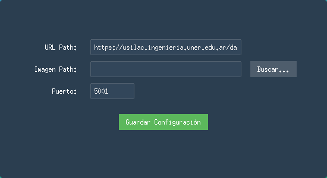
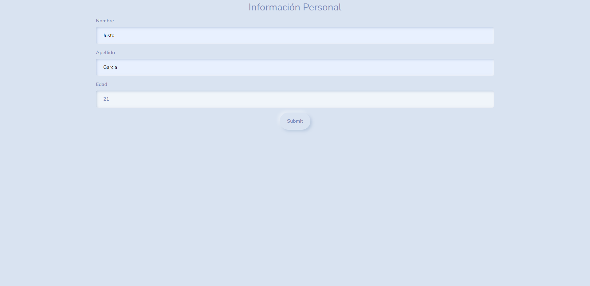
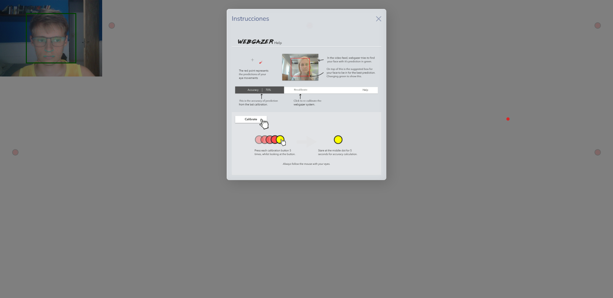
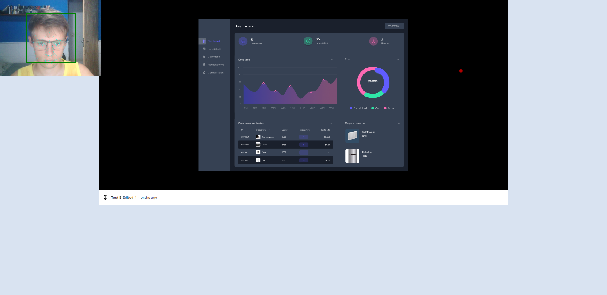

# Herramienta de Seguimiento de Interacciones del Usuario con Prototipos

Esta aplicación web utiliza Flask como backend para gestionar la entrada de datos y WebGazer.js en el frontend para realizar el seguimiento de la vista del usuario. El flujo básico de la aplicación es el siguiente:

1. **Página de Inicio (/):** Aquí encontrarás un formulario de entrada de datos. Los usuarios deben completar el formulario y hacer clic en "Submit" para avanzar.

2. **Página de Gaze Tracking:** Después de enviar el formulario, serás redirigido a una página donde se iniciará el seguimiento de la vista mediante WebGazer.js. La página pasará por una fase de calibración con una serie de botones y luego mostrará un prototipo de Figma para registrar el comportamiento de la vista del usuario. Los datos obtenidos se irán registrando en una base de datos de SQLite (puede luego cambiarse, esta fue seleccioanda por conveniencia para el desarrollo).

3. **Página de sujetos (/sujetos):** Se pueden ver los sujetos presentes en la base de datos. Se puede acceder a la información de cada sujeto y ver los datos de seguimiento de la vista.

4. **Página de resultados para un sujeto (/resultados?id={sujeto}):** Se puede ver el heatmap de la mirada de un sujeto y descargar sus datos en formato csv.

## Uso del Proyecto

### 1. Clona este repositorio

```bash
git clone https://github.com/justogm/user-gaze-track.git
cd user-gaze-track
```

### 2. Instala los requerimientos

```bash
pip install -r requirements.txt
```

### 3. Generar certificados
Para poder utilizar el módulo de gaze tracking debe soportar https. Por ello, deben crearse las credenciales para que funcione correctamente.

```bash
openssl req -x509 -newkey rsa:4096 -nodes -out cert.pem -keyout key.pem -days 365
```

Este comando realizará una serie de preguntas y finalmente creará los archivos *cert.pem* y *key.pem* que utilizará Flask.

### 4. Configurar la herramienta

La herramienta cuenta con una interfaz de configuración que puede ser ejecutada con:

```bash
python src/config.py
```

Esto abrirá la siguiente ventana que te permitirá cargar una url o una imágen y seleccionar el puerto en el que quieras que corra la herramienta



Se debe modificar el archivo [config/config.json](config/config.json) estableciendo el puerto en el que se debe correr y el la url a una imagen o prototipo que se desee utilizar.

### 5. Correr la herramienta

```bash
python src/app.py
```

## Importante

> [!CAUTION]
> Esta herramienta está en desarrollo y está pensada para entornos controlados, aún presenta severas vulnerabilidades para su distribución. Se recomienda no utilizarla en entornos de producción.

## Tecnologías relevantes

- [Flask](https://flask.palletsprojects.com/en/3.0.x/)
- [WebGazer.js](https://webgazer.cs.brown.edu/)
- [heatmap.js](https://www.patrick-wied.at/static/heatmapjs/)
- [SQLite](https://www.sqlite.org/index.html)

## Capturas de pantalla

### 1. Ingreso de datos

Puede ser modificado de acuerdo a las variables que se consideren relevantes.



### 2. Etapa de calibración e instrucciones



*La imagen de instrucciones para la calibración es la proporcionada por el módulo, sería conveniente crear una que se encuentre traducida al español.*

### 3. Presentación del prototipo



## TODO

- [ ] Evaluar comportamiento del modulo en caso de tener el prototipo en pantalla completa.
- [ ] Analizar alternativas para la presentación del prototipo.
- [x] Facilitar el cambio del prototipo, no dejarlo hardcodeado.
  - Se crea archivo de configuración, ver [sección de configuración](#4-configurar-la-herramienta).
- [x] Desarrollar una app paralela para el acceso a los datos generados y su manipulación.
  - Se desarrolló la ruta `/sujetos`
